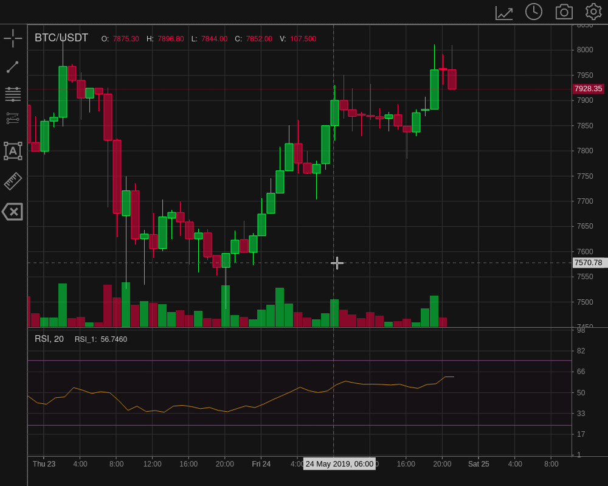

# README

## WIP - under heavy development

TradeX-chart is a trade chart written in plain (vanilla) JavaScript with minimal dependencies; use it with any framework or backend.

It provides a two way API to give you complete control over the chart.



## Table of Contents

* [Why](#why)
* [Demo](#demo)
* [Getting Started](#getting-started)
* [Documentation](/docs/documentation.md)
* [Features](#features)
* [License](/LICENSE)

## Why

TradeX-chart was created to give you the developer the freedom to choose your framework and not lock you in.

Secondly after talking to other developers, top on their wishlist for a trading chart was more direct control over it, so they could create their own custom plots. The extensive API will give you power over your chart data like you never had before. Subscribe to the internal events messaging to trigger events in your own application.

## Getting Started

### Requirements

TradeX-chart targets browsers that support [ECMAScript 2022](https://www.ecma-international.org/wp-content/uploads/ECMA-262_13th_edition_june_2022.pdfhttps:/).

## Demo

### [Live Demo](https://tradex-chart.guildmedia.net)

Run the demo locally:

```
npm install
npm run demo
```

### Development

```
npm install
npm run dev
```

### Build

```
npm install
npm run build
```

### Production

How to use the chart in production... coming soon to a repo near you, once it is added to [npmjs.com](https://npmjs.com).

## Documentation

Full documentation including API can be found under [docs](/docs/documentation.md).

## Features

* Plain JavaScript with no framework dependencies
* WIP: All chart features and functions accessible via API
* Built in a modular manner
* Build your own modular plugins
* Provides message, emit and subscribe methods
* State object defines chart configuration, on and off chart indicators, drawing tool overlays and can be imported or exported.
* Chart implements a multi-layer canvas class which makes overlays easy. It also supports interaction through hit detection.
* Export chart to png, jpg, webp.
* Indicator calculation provided by [talib-web](https://https://anchegt.github.io/talib-web/) as a WebAssembly module.
* Supports multiple candle types:
  * solid
  * hollow
  * solid up, hollow down
  * hollow up, solid down
  * OHLC
  * TODO: area
* Chart pan / scroll via mouse or cursor keys
