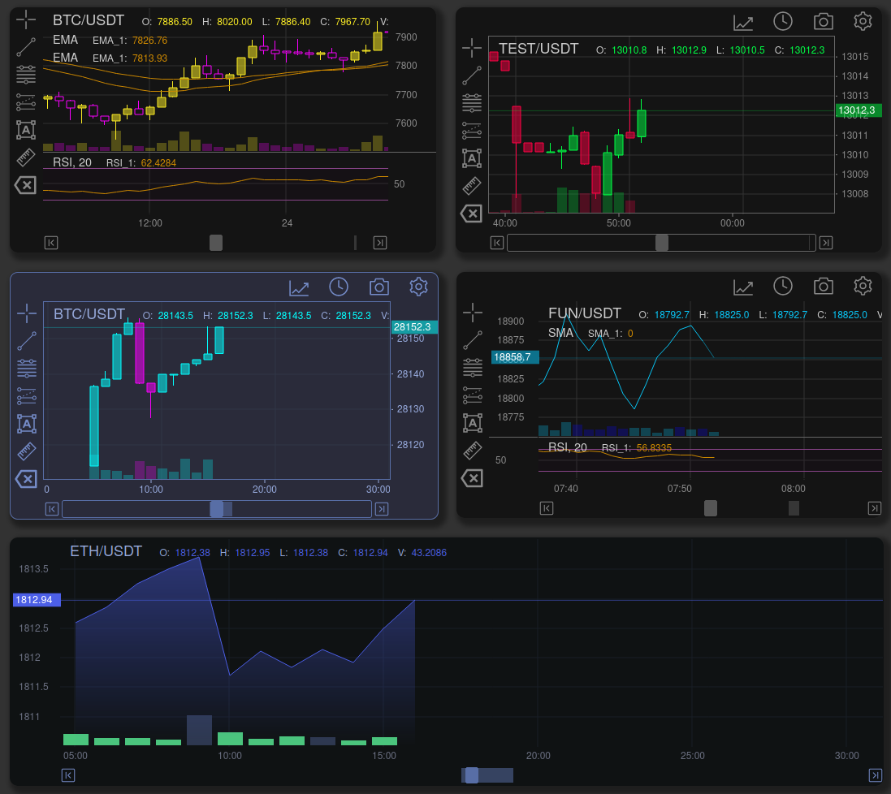

# README

TradeX-chart is a highly customizable stock trade chart with **one** dependency written in plain JavaScript; use it with any framework or backend.

<div align="center">

[](https://www.npmjs.com/package/tradex-chart)
[](https://bundlephobia.com/result?p=tradex-chart)
[](LICENSE)
[](https://github.com/tradex-app/TradeX-chart)
[](https://discord.gg/6XS9tDrcdq)

</div>



## Table of Contents

* [Demo](#demo)
* [Getting Started](#getting-started)
* [Documentation](/docs/documentation.md)
* [Features](#features)
* [License](/LICENSE)

## Demo

### [Live Demo](https://tradex-chart.guildmedia.net/)

## Getting Started

### Requirements

TradeX-chart targets browsers that support [ECMAScript 2022](https://www.ecma-international.org/wp-content/uploads/ECMA-262_13th_edition_june_2022.pdfhttps:/).

## Install

### NPM

```
npm install tradex-chart
```

### In Browser

```
<script src="tradex-chart.es.js"></script>
```

## How to Use

Minimal working example:

```javascript
<div id="myChartDiv"></div>

<script>

import {Chart, DOM} from 'tradex-chart'
import * as talib from "talib-web"

// minimal data state
let state = {
  "ohlcv": [
// [timestamp, open, high, low, close, volume]
    [1543579200000,4035.6,4072.78348726,3965,4055.6,2157.50135341],
    [1543582800000,4055.6,4100,4035,4059.1719252,1660.6115119],
    [1543586400000,4059.1,4076.6,4014.1,4060,1070.09946267],
    [1543590000000,4060.5,4060.5,3987.2,4049.2,1530.46774287],
    [1543593600000,4049.2,4092.7,4035,4089.6691106,922.84509291]
  ]
}

// minimal config
const config = {
  id: "TradeX_test",
  title: "BTC/USDT",
  width: 1000,
  height: 800,
  utils: {none: true},
  tools: {none: true},
  talib: talib,
  // see configuration.md#config regarding talib.wasm
  // `${window.location.origin}/talib.wasm`
  rangeLimit: 30,
}

const mount = document.getElementById('myChartDiv')
const chart = document.createElement("tradex-chart")

mount.appendChild(chart)
chart.start(config)

</script>
```

## TypeScript

Types provided

## Documentation

Documentation can be found here:
[Documentation](https://tradex-app.github.io/TradeX-chart/)

or built and run locally from the repository by running:

```shell
git clone https://github.com/tradex-app/TradeX-chart
cd ./tradex-chart/src/docs
npm run build
```

## Editable Live Sandbox Examples

Editable sandbox examples can found on [CodeSandbox.io](https://codesandbox.io/u/tradex-app)

## Framework Integration Examples

* [React / NextJS](nextjs)
* [Vue](https://github.com/tradex-app/TradeX-Chart-Vue-JS)
* Svelte (TODO:)

## Features

* Plain JavaScript with no framework dependencies
* All chart features and functions accessible via [API](https://tradex-app.github.io/TradeX-chart/api/core/)
* [State object](https://tradex-app.github.io/TradeX-chart/reference/state/) defines [chart configuration](https://tradex-app.github.io/TradeX-chart/reference/02_configuration/), [indicators](https://tradex-app.github.io/TradeX-chart/reference/indicators_default/) and tools
* State can be [imported](https://https://tradex-app.github.io/TradeX-chart/reference/state/#create-and-use-a-state) or [exported](https://tradex-app.github.io/TradeX-chart/reference/state/#export) for storage and retrieval
* Indicator calculation provided by [talib-web](https://https://anchegt.github.io/talib-web/) as a WebAssembly module.
* [Custom Themes](https://tradex-app.github.io/TradeX-chart/reference/themes/)
* [Custom Indicators](https://tradex-app.github.io/TradeX-chart/reference/indicators_default/https:/)
* [Custom Overlays](https://tradex-app.github.io/TradeX-chart/reference/overlays_custom/https:/)
* Custom Drawing Tools (to be implemented)
* [Event Hub](https://tradex-app.github.io/TradeX-chart/reference/events/) - subscribe to chart events
* Rendering Optimization - smooth performance
* High frequency chart candles updates
* [Export chart to png, jpg](https://tradex-app.github.io/TradeX-chart/reference/api-examples/#download-image), webp, with optional watermarking

## Support

For the latest news on TradeX-chart, feedback, feature requests, and community, join us over on Discord or GitHub.

* [TradeX Discord](https://discord.gg/6XS9tDrcdq)
* [Issue Tracker](https://github.com/tradex-app/TradeX-chart/issues)
* [GitHub](https://github.com/tradex-app/TradeX-chart/discussions)
* [Discord](https://discord.gg/6XS9tDrcdq)

## Contributing

Testing, [bug reports and feature requests](https://github.com/tradex-app/TradeX-chart/issues) welcome

If you have any bugs, issues, or feature requests, please, before making a submission, first:
* [check the GitHub issue tracker](https://github.com/tradex-app/TradeX-chart/issues)
* [documentation](https://tradex-app.github.io/TradeX-chart/)
* [live examples](https://tradex-chart.guildmedia.net/examples/static_chart/)
* [development roadmap](https://github.com/tradex-app/TradeX-chart/blob/master/docs/TradeX-chart-Development-Roadmap.pdf)

To submit an issue:
* [Fork the chart repostitory](https://github.com/tradex-app/TradeX-chart/fork)
* Create your Feature Branch ``git checkout -b feature/AmazingFeature``
* Commit your Changes ``git commit -m 'Add some AmazingFeature'``
* Push to the Branch ``git push origin feature/AmazingFeature``
* Open a [Pull Request](https://github.com/tradex-app/TradeX-chart/pulls)

You can help speed up development by contributing with crypto or PayPal.

---

```javascript
if (youEnjoyed) {
    starThisRepository();
}
```
                        
## Stargazers over time
[](https://starchart.cc/tradex-app/TradeX-chart)

                    