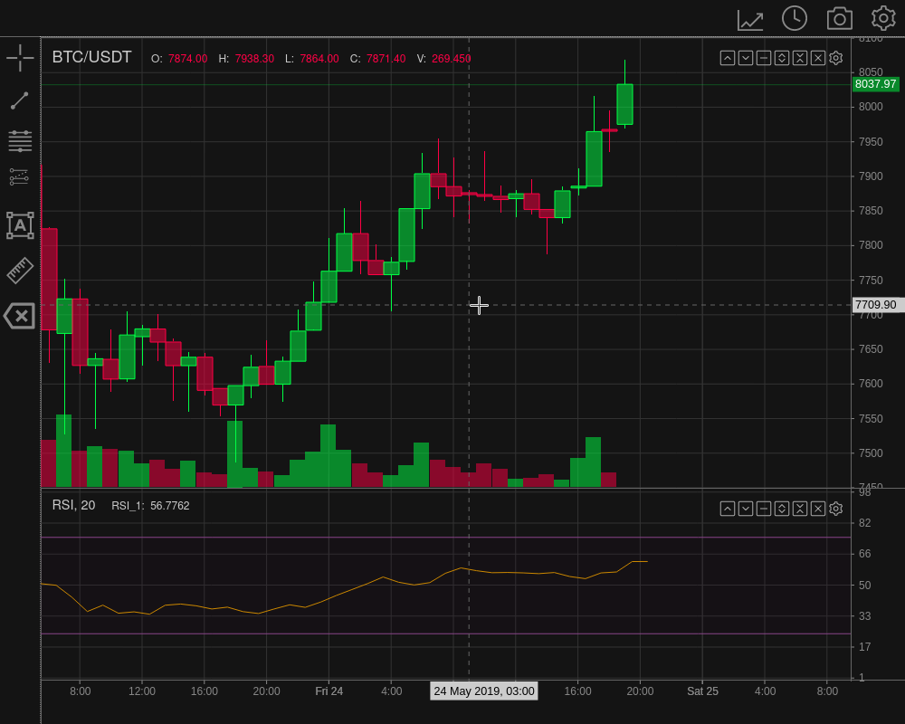

# README

## WIP - under heavy development

TradeX-chart is a trade chart written in plain (vanilla) JavaScript with minimal dependencies; use it with any framework or backend.

It uses an event driven state managed architecture, providing a two way API to give you complete control over the chart.



## Table of Contents

* [Why](#why)
* [Demo](#demo)
* [Getting Started](#getting-started)
* [Documentation](/docs/documentation.md)
* [Features](#features)
* [License](/LICENSE)

## Why

TradeX-chart was created to give you the developer the freedom to choose your framework and not lock you in.

Secondly after talking to other developers, top on their wishlist for a trading chart was more direct control over it, so they could create their own custom plots. The extensive API will give you power over your chart data like you never had before. Subscribe to the internal events messaging to trigger events in your own application.

## Getting Started

### Requirements

TradeX-chart targets browsers that support [ECMAScript 2022](https://www.ecma-international.org/wp-content/uploads/ECMA-262_13th_edition_june_2022.pdfhttps:/).

## Demo

### [Live Demo](https://tradex-app.github.io/TradeX-chart/)

## Install

### NPM

```
npm install tradex-chart
```

### In Browser

```
<script src="tradex-chart.es.js"></script>
```

## How to Use

Minimal working example:

```javascript
<div id="myChartDiv"></div>

<script>

import {Chart, DOM} from 'tradex-chart'
import * as talib from "talib-web"

// minimal data state
let state = {
  "ohlcv": [
// [timestamp, open, high, low, close, volume]
    [1543579200000,4035.6,4072.78348726,3965,4055.6,2157.50135341],
    [1543582800000,4055.6,4100,4035,4059.1719252,1660.6115119],
    [1543586400000,4059.1,4076.6,4014.1,4060,1070.09946267],
    [1543590000000,4060.5,4060.5,3987.2,4049.2,1530.46774287],
    [1543593600000,4049.2,4092.7,4035,4089.6691106,922.84509291]
  ]
}

// or use document.getElementById('myChartDiv')
const mount = DOM.findBySelector('#myChartDiv')

// minimal config
const config = {
  id: "TradeX_test",
  title: "BTC/USDT",
  width: 1000,
  height: 800,
  utils: {none: true},
  tools: {none: true},
  talib: talib,
  rangeLimit: 30,
}

const chart = Chart.create(mount, config, state )
chart.start(chart.getModID())

</script>
```

## Documentation

Full documentation including API can be found under [docs](/docs/documentation.md).

## Features

* Plain JavaScript with no framework dependencies
* WIP: All chart features and functions accessible via API
* Built in a modular manner
* Provides message, emit and subscribe methods
* State object defines chart configuration, on and off chart indicators, drawing tool overlays and can be imported or exported.
* Chart implements a multi-layer canvas class which makes overlays easy. It also supports interaction through hit detection.
* Export chart to png, jpg, webp.
* Indicator calculation provided by [talib-web](https://https://anchegt.github.io/talib-web/) as a WebAssembly module.
* Supports multiple candle types:
  * solid
  * hollow
  * solid up, hollow down
  * hollow up, solid down
  * OHLC
  * TODO: area
* Chart pan / scroll via mouse or cursor keys

## Contributing

* Fork the Project
* Create your Feature Branch (git checkout -b feature/AmazingFeature)
* Commit your Changes (git commit -m 'Add some AmazingFeature)
* Push to the Branch (git push origin feature/AmazingFeature)
* Open a Pull Request

Testing, bug reports and feature requests welcome

You can help speed up development by contributing with crypto or PayPal.

* BTC - bc1qtw2vffqusc3jznn42hykp4sxrjvapsnz8qdqhn
* ETH - 0xe258FA38D130bd6D068F625235CF336c8E16DA1D
* XMR - 48vqLhZUwm32porTqkXDHZCSKHv1mqkrkCirKrrGK57xD59vHxv7gH3LmBc1UTFqs12eNWLExHFfYMx5KwyGSH9zVskgqsQ
* LTC - LKgHqsk3Tc2Z3uqos1Jzcw3fakXpfvp85r
* DIA (ETH) - 0xe258FA38D130bd6D068F625235CF336c8E16DA1D
