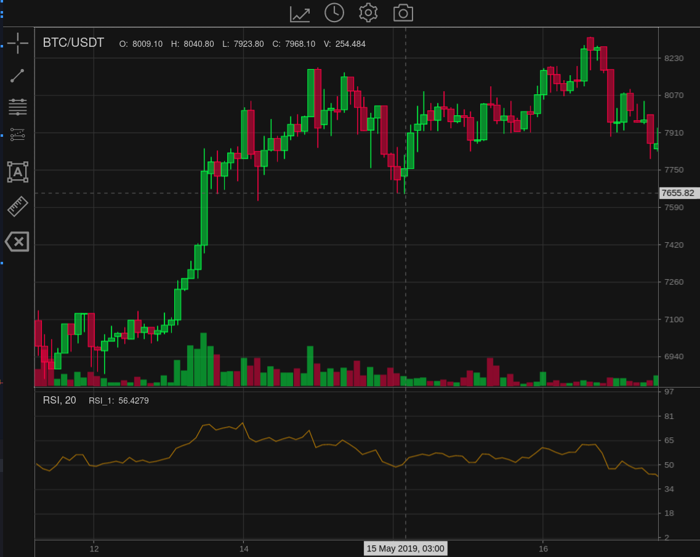

# README

## WIP

A trade chart written in plain (vanilla) JavaScript with minimal dependencies

WIP: All chart features and functions accessible via API

Built in a modular manner and provides message, emit and subscribe methods.

State object defines chart configuration, on and off chart indicators, drawing tool overlays and can be imported or exported.

Chart implements a multi-layer canvas class which makes overlays easy. It also supports interaction through hit detection.

Export chart to png, jpg, webp.

Indicator calculation provided by [talib-web](https://https://anchegt.github.io/talib-web/) as a WebAssembly module.

Supports multiple candle types:

* solid
* hollow
* solid up, hollow down
* hollow up, solid down
* OHLC
* TODO: area

Chart pan / scroll via mouse or cursor keys
