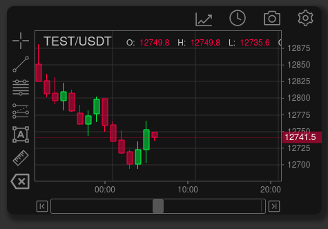
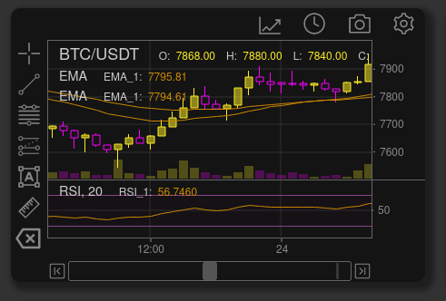
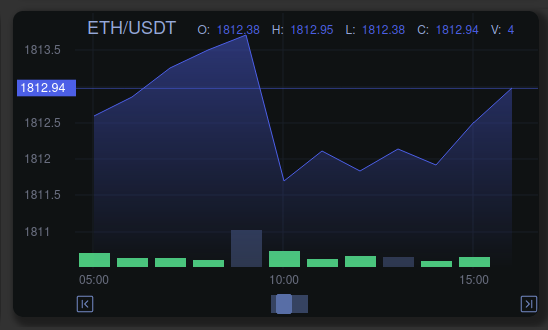
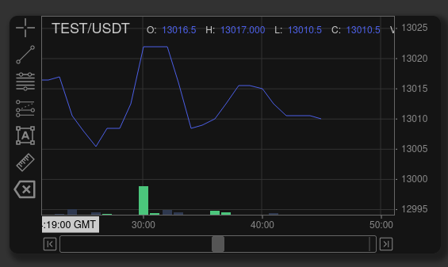

# Configuration

```javascript
  // Create an empty chart and insert into the DOM
  let chart = document.createElement("tradex-chart")
  let mount = document.getElementByID("#mount")
      mount.appendChild(chart)
      chart.start(config)
```

A DOM element is requried to mount the chart. Any contents of the element will be replaced by the chart

TradeXChart is configured with three requirements:

1. HTML DOM element - to mount the chart on
2. config
3. state

## config

Config describes the basics of the chart, size, ect. and requires the following minimum properties to be valid:

```javascript
// minimal config
const config = {
  id: "TradeX_test",
  title: "BTC/USDT",
  width: 1000,
  height: 800,
  talib: talib,
  rangeLimit: 30,
}
```

``talib`` is a pointer to the [talib-web](https://https//anchegt.github.io/talib-web/) technical indicator library compiled as a WebAssembly module. TradeX-chart will take care of instantiating it.

``rangeLimit`` defines the initial number of candles to display

Further config options are explained in [config.md](config.md)

## State

State is a snapshot of the entirety of the chart data state, including chart price data, indicators, drawing tools, datasets and theme. Where properties of Config and ``state.settings`` overlap, Config properties take priority.

Future versions of TradeX-chart will allow you to swap chart states.

The chart state can be exported to be reused later.

```javascript
JSON.stringify(chart.state)
```

Details of the state structure are found in [state.md](state.md)

# Candle Types

```javascript
export const CandleType = {
  CANDLE_SOLID: 'candle_solid',
  CANDLE_HOLLOW: 'candle_hollow',
  CANDLE_UP_HOLLOW: 'candle_up_hollow',
  CANDLE_DOWN_HOLLOW: 'candle_down_hollow',
  OHLC: 'ohlc',
  AREA: 'area',
  LINE: 'line'
}
```

## CANDLE_SOLID

## CANDLE_HOLLOW

## CANDLE_UP_HOLLOW

## CANDLE_DOWN_HOLLOW

## OHLC

## AREA

## LINE



# Config

```javascript
const config = {
  id: "TradeX_test",
  title: "BTC/USDT",
  width: 1000,
  height: 800,
  // utils bar config
  utils: {none: true},
  // tools bar config
  tools: {none: true},
  // timeframes: s, m, h, d, M, y
  timeFrame: "1m",
  // timestamp for the chart to start on
  rangeStartTS: rangeStartTS,
  // number of candles for the chart to display on start
  rangeLimit: 30,
  // number of empty candles (time frame units) the chart will display after the last candle
  limitFuture: 200,
  // number of empty candles (time frame units) the chart will display before the first candle
  limitPast: 200,
  // minimum candles the chart will zoom to and display
  minCandles: 20,
  // maximum candles the chart will zoom to and display
  minCandles: 1000,
  // "padding" added to upper and lower price bounds for display
  yAxisBounds: 0.005,
  // chart theme
  theme: {
    candle: {
      Type: "candle_solid",
      UpBodyColour: "#00F04088",
      UpWickColour: "#0F4",
      DnBodyColour: "#F0004088",
      DnWickColour: "#F04",
    },
    volume: {
      Height: 15,
      UpColour: "#00F04044",
      DnColour: "#F0004044",
    },
    chart: {
      Background: "#141414",
      BorderColour: "#666",
      GridColour: "#333",
      TextColour: "#ccc"
    },
    onChart: {

    },
  },
  // used for chart data validation, timestamps compared against BTC genisis block
  isCrypto: true,
  logs: false,
  infos: true,
  warnings: true,
  errors: true,
  // enable live updates for a price stream
  stream: {},
  // maximum rate in milliseconds that a live stream should be REDRAWN, does not throttle actual stream rate
  maxCandleUpdate: 250,
  // pointer to talib-web library, required if you want to see indicators
  talib: talib
}
```
