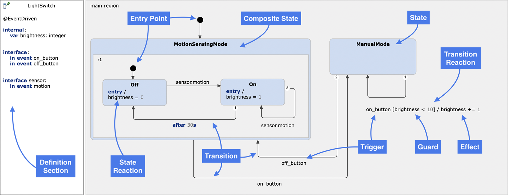
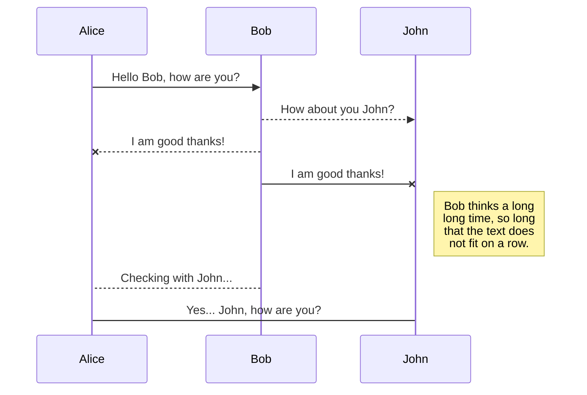
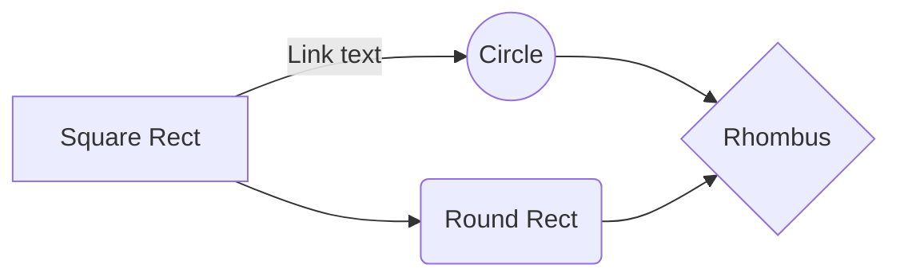

# TradeXChart

**Hook Observer Pattern**
An extensible API like WordPress
making it easy for third party programmers to write extensions to the core

**Aspect-Oriented Programming**
Code injection
into existing functions or objects, without modifying the target logic.

**State Machine**
Logical state management
providing a behaviour model describing the states the system can be in and the conditions by which one transitions to another.

**Global Store**

**Event Hub**

**Scalable Application Architecture**
Decoupled, event-driven architecture

**Model Contoler View**

## Aspect-Oriented Programming

Code injection

[https://en.wikipedia.org/wiki/Aspect-oriented_programming](https://en.wikipedia.org/wiki/Aspect-oriented_programming)

### Meld

[https://github.com/cujojs/meld](https://github.com/cujojs/meld)

## State Machine

Logical state management

[https://www.itemis.com/en/yakindu/state-machine/documentation/user-guide/quick_ref](https://www.itemis.com/en/yakindu/state-machine/documentation/user-guide/quick_ref)

## Scalable Javascript Applicaton Architecture

decoupled, event-driven architecture

The features of the architecture are decoupled, allowing for flexible and extensible applications. The application is broken down into the following parts:

* Modules
* Sandbox
* Application Core
* Base Libraries

#### Module

Modules are single-purpose parts of a larger system that are interchangeable.

References: [1]

#### Sandbox

A Sandbox is an object which is an instance of the Core, creating a siloed API for the Module. None of the modules can directly mutate each other or the Core.

The Sandbox uses a Facade [2] and Mediator [3] pattern.

Modules can interact with the Core and each other via the Mediator which has inheirited a specific methods and properties (Facade) from the Core.

#### Core

The Core is responsible for starting and stopping the modules. It also handles the messages by using the [Publish/Subscribe (Mediator) pattern](https://en.wikipedia.org/wiki/Publish%E2%80%93subscribe_pattern).

#### Plugins

Plugins extend or mofify the functionality of the Core.

### Design Patterns

#### Facade

The Facace is a unifying (simplified) API for the [Application Core](#application-core).

It serves as an **abstraction** of the application core which sits between the mediator and our modules - it should ideally be the **only** other part of the system modules are aware of.

In that way you can hide the features provided by the core and only show a well defined custom static long term API to your modules.

References: [2]

#### Mediator

A mediator **encapsulates** how disparate modules **interact**
with each other by acting as an intermediary. The pattern also promotes
loose coupling by preventing objects from referring to each other
explicitly - in our system, this helps to solve our module
inter-dependency issues.

It provides the Facade to Module, by extending the Module class.

Refrences: [3]

# References

1. [Modlule - https://addyosmani.com/largescalejavascript/#modpattern](https://addyosmani.com/largescalejavascript/#modpattern)
2. [Facade - https://addyosmani.com/largescalejavascript/#facadepattern](https://addyosmani.com/largescalejavascript/#facadepattern)
3. [Mediator - https://addyosmani.com/largescalejavascript/#mediatorpattern](https://addyosmani.com/largescalejavascript/#mediatorpatternhttps:/)
4.

---

# Advanced Mark Down

[https://stackedit.io/app#](https://stackedit.io/app#)

## SmartyPants

SmartyPants converts ASCII punctuation characters into "smart" typographic punctuation HTML entities. For example:

|                  | ASCII                           | HTML                          |
| ------------------ | --------------------------------- | ------------------------------- |
| Single backticks | `'Isn't this fun?'`             | 'Isn't this fun?'             |
| Quotes           | `"Isn't this fun?"`             | "Isn't this fun?"             |
| Dashes           | `-- is en-dash, --- is em-dash` | -- is en-dash, --- is em-dash |

## KaTeX

You can render LaTeX mathematical expressions using [KaTeX](https://khan.github.io/KaTeX/):

The *Gamma function* satisfying $\Gamma(n) = (n-1)!\quad\forall n\in\mathbb N$ is via the Euler integral

$$
\Gamma(z) = \int_0^\infty t^{z-1}e^{-t}dt\,.

$$

> You can find more information about **LaTeX** mathematical expressions [here](http://meta.math.stackexchange.com/questions/5020/mathjax-basic-tutorial-and-quick-reference).

## UML diagrams

You can render UML diagrams using [Mermaid](https://mermaidjs.github.io/). For example, this will produce a sequence diagram:

And this will produce a flow chart:

