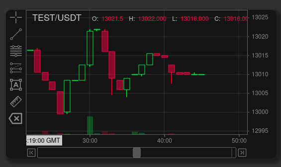
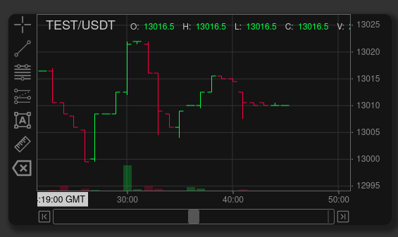

Chart themes can be set either via the initial config that the chart is instantiated with or afterwards via the API.

For a full list of theme options refer to the [config](configuration.md) documentation.

## Loading a New Theme

TODO: text goes here...

## Modifying Individual Properties

The API offers granular control over the theme property values.

Nested theme properties are referenced via the path parameter as a string, using the same notation Javascript uses for objects.

### setProperty(path, value)

Sets theme property value and refresh the chart to actualize the change. Method returns the previous value. If the path (property) does not exist, it will return ``undefined``.

**Parameters**

* @param {string} path - "candle" or "candle.Type"
* @param {*} value
* @returns {*} - previous value

**Examples**

Setting on specific value
```javascript
chart0.theme.setProperty("candle.Type", "candle_up_hollow")
```

setting multiple values via the parent property.
```javascript
const candleTheme = {
      Type: "candle_down_hollow",
      UpBodyColour: "#FAEB2488",
      UpWickColour: "#FAEB24",
      DnBodyColour: "#F900FE88",
      DnWickColour: "#F900FE",
    }
chart0.theme.setProperty("candle", candleTheme)
```

:::note
Do not directly modify the theme values. the ``setProperty()`` must be used.
:::

### getProperty(path)

``getProperty(path)`` behaves similarly to ``setProperty()`` in that the parameter accepts a string in object dot notation. Method returns the previous value. If the path (property) does not exist, it will return ``undefined``.

**Parameters**

* @param {string} path - "candle" or "candle.Type"
* @returns {*}

**Examples**
```javascript
chart0.theme.getProperty("candle.Type")
```

## Theme Properties


### Candle Types

```javascript
export const CandleType = {
  CANDLE_SOLID: 'candle_solid',
  CANDLE_HOLLOW: 'candle_hollow',
  CANDLE_UP_HOLLOW: 'candle_up_hollow',
  CANDLE_DOWN_HOLLOW: 'candle_down_hollow',
  OHLC: 'ohlc',
  AREA: 'area',
  LINE: 'line'
}
```

#### CANDLE_SOLID

#### CANDLE_HOLLOW

#### CANDLE_UP_HOLLOW

#### CANDLE_DOWN_HOLLOW

#### OHLC

#### AREA

#### LINE


